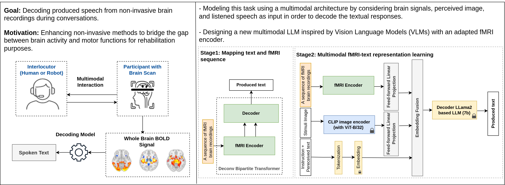

### A Multimodal LLM for the Non-Invasive Decoding of Spoken Text from Brain Recordings




 In this paper, we propose and end-to-end multimodal large language model for decoding the spoken text in a human-human or human-robot interactions. The proposed architecture is founded on  ($i$) an encoder derived from a specific transformer with the incorporation of an augmented embedding layer for the encoder and a better-adjusted attention mechanism than that present in the state of the art, and ($ii$) a frozen LLM adapted via instruction tuning to align the embedding of the input modalities to decode the output text. A benchmark in performed on two publicly available datasets where fMRI brain activity and conversational signals are recorded synchronously.

## Requirements
* python 3.12.2
* Required packages:  ```python install -r requirement.txt```
* vicuna-7b-v1.3 from https://huggingface.co/lmsys/vicuna-7b-v1.3 in the folder 'LLMs' (or other LLMs such as Meta-llama3.2-8b-Instruct)
* CLIP in the main folder: git clone https://github.com/openai/CLIP
* To use other data paths, change the configuration file in 'src/configs'.

## Experiments
This benchamrk contains three experiments associated to three different tasks and datasets:
 - Spoken text decoding (convers): Multimodal spoken text decoding during conversations (main task of this work).
 - Perceived speech decoding (perceived): Decoding the textual content of listened stories.
 - Brain captioning (NSD): Decoding the captions of viewed images using the NSD datasets.
 - Decoding reading text from EEG signals.

In the following, we detail the steps to conduct or reproduce the results of each experiment.

### 1. Spoken Text Decoding
#### Configuration
- Update the configuration files "srs/configs/perceived/configs.py" by specifying the following paths: __DATA_PATH__ (ex. data/convers), __RAW_FMRI_DATA_PATH__ (ex. data/fmri_convers), __MODELS_TRAIN_PATH__ (ex. trained_models/convers), __LLM_PATH__ (ex. LLMs/Meta-llama3.2-8b-Instruct)

- Download the version 2.2.0 of the Convers datasets from the OpenNeuro platform [ds001740](https://openneuro.org/datasets/ds001740/versions/2.2.0)
 inside __RAW_FMRI_DATA_PATH__ specified in the config file.

- Create a folder named "raw_data/transcriptions" inside __DATA_PATH__ and upload  the raw Transcriptions from the Ortolang platform [convers/v2](https://www.ortolang.fr/market/corpora/convers/v2) into it:


With DATA_PATH set to "data/convers" for example, you should obtain a structure similar to this after data preprocessing:

```
data/
└── convers/
    ├── preprocessed_fmri_data/
    │   └── fMRI_data_200/
    ├── processed_data/
    │   ├── fMRI_data_split/
    │   ├── interlocutor_text_data/
    │   └── participant_text_data/
    ├── raw_data/
    │   ├── transcriptions/
    │   └── fmri/
    ├── test.json
    └── train.json
```


#### Preprocessing and evaluation
```bash
# Preprocessing raw data
python exps/convers/process_raw_bold_signal.py --n_rois 200 # Parcellation using 200 ROIs
python exps/convers/data_builder_tools/split_bold_files.py  # Processing raw 4D voxel BOLD signals and segmenting them into fixed-duration chunks
python exps/convers/data_builder_tools/textgrid_to_text.py # Processing transcription files (conversations) and segmenting them into fixed-duration text sequences

# Building training and test data
python exps/convers/data_builder_tools/build_data.py # Using json files to save paths of bold chunks and the [input, output] text for instruction tuning
python exps/convers/data_builder_tools/build_tokenizer.py # Building the tokenizer for the first stage of training

# Training and testing after each save_epoch
python  exps/convers/train_stage1.py -m DeconvBipartiteTransformerConv --batch_size 128 --epochs 200 # Stage1: training the DeconvBipartite Transformer
python  exps/convers/train_stage2.py --batch_size 32 --epochs 100  -m BrainDEC_V0  --save_epochs 50 # Stage2. Note: BrainDEC_V1 or BrainDEC_V2 converge quickly than V0, only 20 epochs are needed.

# Evaluate the results of the test set and save the scores
python exps/convers/evaluation.py   
```   


### 2. Perceived Speech Decoding
#### Configuration
- Update the configuration files "srs/configs/perceived/configs.py" by specifying the following paths: __RAW_FMRI_DATA_PATH__ (ex. data/perceived), __MODELS_TRAIN_PATH__ (ex. trained_models/perceived), and __LLM_PATH__ (ex. LLMs/Meta-llama3.2-8b-Instruct).


####  Data preparation
* In the folders "DATA_TRAIN_DIR" and "DATA_TEST_DIR" (see the config file), download the training and test datasets as outlined in the project [semantic-decoding](https://github.com/HuthLab/semantic-decoding).

With DATA_PATH set to "data/perceived" for example, you should obtain a structure similar to this after data preprocessing:

```
data/
└── perceived/
    ├── data_test/
    ├── data_train/
    └── processed/
        ├── S1/
        ├── S2/
        ├── S3/
        ├── fMRI_data_test_split/
        └── fMRI_data_train_split/
```

#### Preprocessing and evaluation
```bash
# Data preparation
python exps/perceived/prepare_datasets.py -s $subject (for $subject  in ['S1', 'S2', 'S3'])

# Build tokenizer for stage 1
python exps/perceived/build_tokenizer.py

# Training and testing after each save_epoch
python exps/perceived/train_stage1.py --batch_size 128
python exps/perceived/train_stage2.py --batch_size 32 -s $subject (for $subject  in ['S1', 'S2', 'S3'])

# Evaluate the results of the test set and save the scores
python exps/perceived/evaluation.py $subject ((for $subject  in ['S1', 'S2', 'S3'])
```   

###  3. Brain Captioning - BrainHub benchmark on NSD dataset
This a comparison with brain understanding benchmark ([BrainHub](https://github.com/weihaox/BrainHub)), based on Natural Scenes Dataset [NSD](https://naturalscenesdataset.org/) and [COCO](https://cocodataset.org).

#### Configuration
- The processed datasets are available in [here](https://huggingface.co/datasets/pscotti/naturalscenesdataset).
- Download the datasets using this [script](https://github.com/weihaox/UMBRAE/blob/main/umbrae/download_data.sh).
- Download COCO annotations from this [link](https://huggingface.co/datasets/pscotti/naturalscenesdataset/blob/main/COCO_73k_annots.npy), and put it in the folder 'tools'
- Update the configuration file 'src/configs.nsd/configs_nsd.py' to specify the paths, and eventually to modify the hyperparameters.
- To train and evaluate the model:
```bash
python exps/nsd/main.py --epochs 6 --save_epochs 1 --batch_size 32 -s $subject (choices=[1, 2, 5, 7])
```   
- To get the evaluation scores for each subject based on the generated files of the test set, refer to the Benchmark [project](https://github.com/weihaox/BrainHub).
- Please be aware that the training process involves non-deterministic algorithms even with fixed seed, which can lead to slightly different results on each run.
In our case, we ran the training procedure 5 times for 7 epochs each, and selected the best result.
 **TODO**: Implementing a fully deterministic mode, even if it may impact the overall performance.

### 4. Decoding Reading Text from EEG Signals
#### Configuration and data preparation
The same raw data and preprocessing presented in [EEG-To-Text](https://github.com/MikeWangWZHL/EEG-To-Text) are employed here.

* Update the configuration files "srs/configs/zuco/configs.py" by specifying the paths similarly to the previous experiments.
* Download the following folders from [ZuCo v1.0](https://osf.io/q3zws/files/) and place them in the `DATA_PATH` specified in the config file (e.g., `data/zuco/task1-SR/Matlab_files`, etc.).
* Download `task1-NR/Matlab_files` from [ZuCo v2.0](https://osf.io/2urht/files/) and place it as `task2-NR-2.0/Matlab_files` inside `DATA_PATH`.
* Generate the preprocessed data using the following instructions:


With DATA_PATH set to data/zuco, for example, you should obtain the following structure after data preprocessing:

```
data
└── zuco
    ├── processed
    │   ├── task1-SR
    │   ├── task2-NR
    │   ├── task2-NR-2.0
    │   └── task3-TSR
    ├── task1-SR
    │   └── Matlab_files
    ├── task2-NR
    │   └── Matlab_files
    ├── task2-NR-2.0
    │   └── Matlab_files
    └── task3-TSR
        └── Matlab_files
```

#### Preprocessing and evaluation
```bash
# Data preparation
python exps/zuco/preprocess_data.py -t task1-SR
python exps/zuco/preprocess_data.py -t task2-NR
python exps/zuco/preprocess_data.py -t task3-TSR
python exps/zuco/preprocess_data_v2.py

# Build tokenizer for stage 1
python exps/zuco/build_tokenizer.py

# Training and evaluation
python exps/zuco/train_stage1.py --batch_size 128 --epochs 20
python exps/zuco/train_stage2.py --batch_size 16 --epochs 4
python exps/zuco/evaluation.py
```   

## TODO
- [x] Apply the proposed methodology for NSD datasets.
- [x] Test other LLM decoders.
- [x] Add experiments for decoding text from EEG signals.
- [ ] Cross-subject training for NSD dataset.

## Notes
* The structure of this repository is in work progress
* Some parts of the code of this project are adapted from [InstructBlip](https://github.com/salesforce/LAVIS/blob/main/projects/instructblip/README.md), we thank the authors for their great work.

* In the comparison on perceived speech decoding, we used the same datasets and configuration setup in this [article](https://www.nature.com/articles/s41593-023-01304-9). Data preprocessing and preparation scripts are taken from this [link](https://github.com/HuthLab/semantic-decoding). We thank the authors for their great work.


## Citation
```bibtex
@article{hmamouche2024multimodal,
  title={A multimodal LLM for the non-invasive decoding of spoken text from brain recordings},
  author={Hmamouche, Youssef and Chihab, Ismail and Kdouri, Lahoucine and Seghrouchni, Amal El Fallah},
  journal={arXiv preprint arXiv:2409.19710},
  year={2024}
}
```
